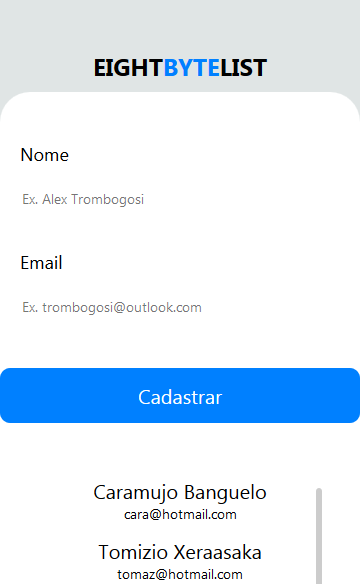

<!-- Logo -->
<p align="center">
  
</p>

<!-- Título&Descrição -->
<h1 align="center" id="title">EightByteList</h1>
<p align="center">Esta é uma aplicação mobile extremamente simples, desenvolvida com fins de estudo e aprendizado, realiza simples registros e validações para exibir os dados abaixo do formulário de cadastro. Foram utilizados registros locais e temporários apenas para exibição via FlatList. Sendo assim lembre-se que tudo nesta aplicação são dados e informações fictícias.</p>

<!-- Estado da aplicação -->
<h4 align="center"> 
	🚧  EightByteList em construção...  🚧
</h4>

<!-- Menu -->
<p align="center">
	<a href="#screenshots">Screenshots</a> • 
	<a href="#tecnologias">Tecnologias</a> • 
	<a href="#features">Features</a> •
	<a href="#pre">Pré-Requisitos</a> • 
	<a href="#run">Rodando a aplicação</a> • 
	<a href="#autor">Autor</a>
</p>
<!-- Shield -->
<p>
	</img>
	</img>
</p>

<!-- Screenshots -->
<h2 align="left" id="screenshots">Screenshots</h2>
<p align="center">
  
</p>

<!-- Features -->
<h2 align="left" id="tecnologias">Tecnologias</h2>

As seguintes ferramentas foram usadas na construção do projeto:

- [Expo](https://expo.io/)
- [Node.js](https://nodejs.org/en/)
- [React Native](https://reactnative.dev/)

<!-- Features -->
<h2 align="left" id="features">Features</h2>

- [x] Cadastro do nome do usuário e email;
- [x] Validação simples do email;
- [x] Lista usuários registrados;

<!-- Pré-Requisitos -->
<h2 align="left" id="pre">Pré-Requisitos</h2>

Antes de começar, você vai precisar ter instalado em sua máquina as seguintes ferramentas:
[Expo](https://docs.expo.dev/get-started/installation/) e [Node.js](https://nodejs.org/en/). É bacana você possuir um editor para trabalhar com o código, fica a dica o [VSCode](https://code.visualstudio.com/).

<!-- Executando o app -->
<h2 align="left" id="run">Rodando a aplicação (web)</h2>

```bash
# Clone este repositório
$ git clone <https://github.com/IN0C3NC10/EightByteList.git>

# Abra a pasta no seu VSCode ou editor de preferência

# Execute o projeto com
$ npm run web

# BeHappy!
```
<!-- Autor -->
<h2 align="left" id="autor">Autor</h2>
<p>
	<a href="https://github.com/IN0C3NC10">
		
	</a>
	<br />
	Feito com ❤️ por <strong>Bruno Inocencio</strong>!
</p>

<p align="left">
  <!-- Outlook -->
  <a href="mailto:bruno.inocencio@fatec.sp.gov.br" alt="Outlook" target="_blank">
    
  </a>
  <!-- Linkedin -->
  <a href="https://cutt.ly/nQlVjQV" alt="Linkedin" target="_blank">
    
  </a>
  <!-- GitHub -->
  <a href="https://github.com/IN0C3NC10" alt="GitHub" target="_blank">
    
  </a>
</p>
